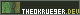
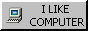

* badges
*DO NOT REMOVE ANY BADGES FROM THIS DIRECTORY, EVER!*
** 80x80
- [[./80x80/icon.gif][Icon]] from the /Saints Row: The Third/'s level 5 Steam badge
- [[./80x80/groove-coaster.gif][Dawn Groover]] from /Groove Coaster: Steam Edition/'s level 5 Steam badge
- [[./80x80/apple.gif][An apple]] from /The Very Hungry Caterpillar/
- [[./80x80/slimecat.gif][The Lucky Slime]] from /Slime Rancher/

** 80x15
- Made by me:
  - [[./80x15/test.gif][Test Badge]]
  - 
  - 
- From [[Web Badges World][https://web.badges.world/]]:
  - 
  - 
  - 
- [[./80x15/gentoo-badge2.gif][Gentoo Web badge 2]], from [[Gentoo.org][https://www.gentoo.org/inside-gentoo/artwork/]]
-  from [[Grimalkin][https://www.grimalkin.org/emacs/]]

** 88x31
- Sorta made by me
  - , traced from [[https://getzola.org][Zola's logo]]
  - , remake of original found on [[https://suitservice.neocities.org/][suitservice]]
- [[./88x31/gplv3.gif]], by Jose Obed for [[https://www.gnu.org/graphics/license-logos.html][GNU]]
- [[./88x31/gnu-linux.gif]], found on [[https://cyber.dabamos.de/88x31/index2.html][[The Cyber Vanguard]]
